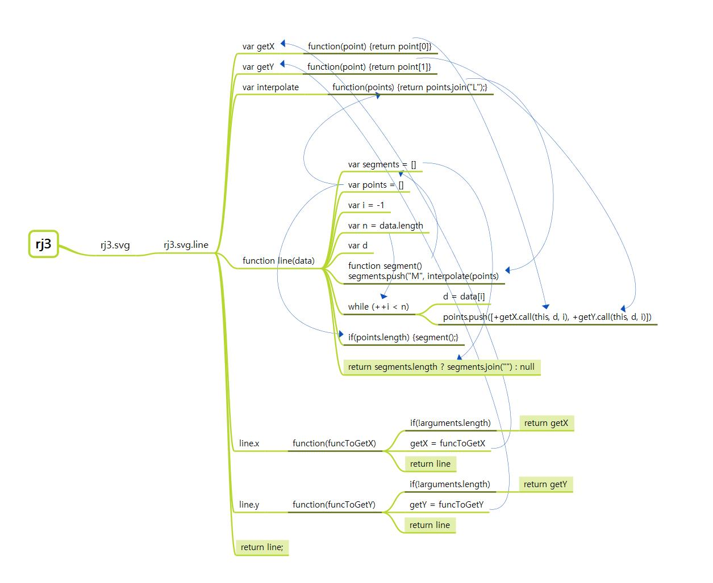
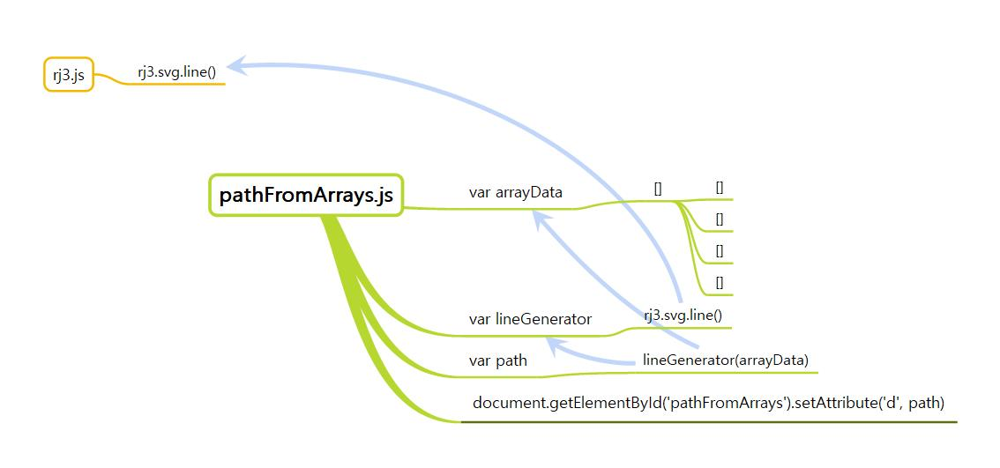

# **자바스크립트 패턴과 테스트**

## **좋은 소프트웨어 만들기**

### **바르게 시작하는 코드 작성하기**
- 사례 연구 : D3.js 의 d3.svg.line 을 축약한 코드 (SVG 라인 생성기) [해당커밋][commit_1]

- 이미지로 참조 관계를 따라가 봤으나... 어떻게 올리는 지 아직 모르겠다.

[commit_1]: [https://github.com/leoh7/study-es6/commit/7bcb2b04454a11d54fc0fb65b9f92137eb393f27]

# **다음 계획**

## **Jekyll 관련**
  - [ ] 만만하게 봤으나 실패한 블로그에 disqus 붙이기... ㅠㅠ
  - [ ]  소스코드  문법을 이쁘게 만들 방법 찾아보기 
    [참고블로그][cf_1]
  - [ ] toc 적용방법 찾기 -> 테마 관련되있을 듯?
    [참고블로그][cf_2]

## **ES6 관련**
  - [x] 자바스크립트 패턴과 테스트 시작하기

## **react 관련**
  - [ ] 리덕스 프로젝트 실습 진행하기

[cf_1]: [https://djkeh.github.io/articles/Hangul-test-jekyll-tips-kor/]
[cf_2]: [https://betterfly88.github.io/etc/%EB%A7%88%ED%81%AC%EB%8B%A4%EC%9A%B4_%EC%B6%94%EA%B0%80/]

# **완료**
## **react 관련**
  - [x] 컴포넌트 스타일링